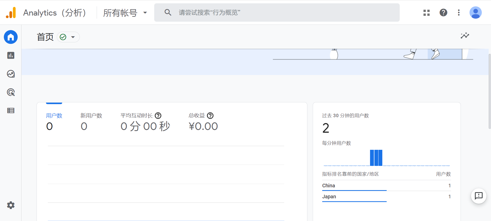

这里需要修改主题，所以使用博客主题时，我使用git clone，然后删除.git

另外一种使用git module的方式，没有研究过

一、注册https://analytics.google.com/


二、获得自己的googleAnalyticsID

登录https://analytics.google.com/

在管理网站页面可以查看，G-4xxxxxx


三、配置

在config.toml

[params]下

添加

```
googleAnalyticsID = "G-00000XXXXX"
```

在主题文件夹创建

layouts/partials/analytics-gtag.html

内容


```
<!-- Global site tag (gtag.js) - Google Analytics -->
<script async src="https://www.googletagmanager.com/gtag/js?id={{ .Site.Params.GoogleAnalyticsID }}"></script>
<script>
  window.dataLayer = window.dataLayer || [];
  function gtag(){dataLayer.push(arguments);}
  gtag('js', new Date());

  gtag('config', '{{ .Site.Params.GoogleAnalyticsID }}');
</script>
```

在主题layouts/_default/baseof.html

在<head>标签里面添加内容


```
{{ if and (hugo.IsProduction) (.Site.Params.googleAnalyticsID) }}
  {{ partial "analytics-gtag.html" . }}
  {{ end }}
```


推送到github,然后访问下自己的网站，查看




参考链接：

https://gist.github.com/zjeaton/42246742cdaf2fb46400d04c2eba9a8a

https://froglegs.co/blog/code/2020/11/google-analytics-4/
